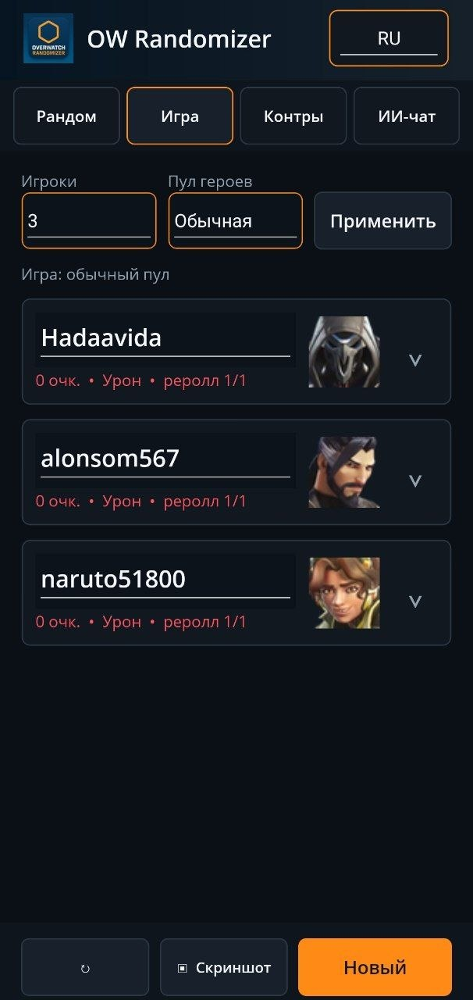
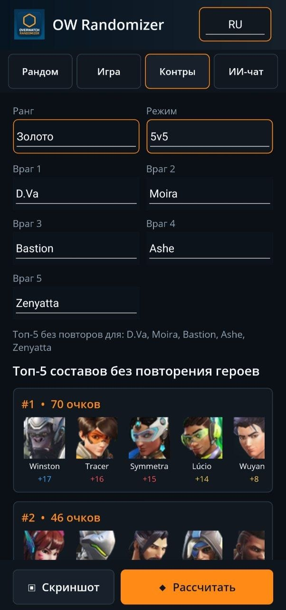

# Overwatch Randomizer

Кроссплатформенный помощник для кастомных игр Overwatch: рандомизация ролей и героев, игровой режим с очками, подбор контрпиков, распознавание скриншотов локальной VLM и отдельный ИИ-чат.

> Неофициальный фанатский проект. Не связан с Blizzard Entertainment.

## Скачать

- [Windows Setup](https://github.com/Mixlazer/Overwatch_Randomizer/releases/latest/download/OverwatchRandomizerSetup.exe)
- [Windows x64 — portable](https://github.com/Mixlazer/Overwatch_Randomizer/releases/latest/download/OverwatchRandomizer-Windows-x64-2.7.zip)
- [Android ARM64 APK](https://github.com/Mixlazer/Overwatch_Randomizer/releases/latest/download/OverwatchRandomizer-arm64-v8a.apk)

Актуальная версия — **2.7**. Готовые файлы и список изменений находятся в [GitHub Releases](https://github.com/Mixlazer/Overwatch_Randomizer/releases).

## Новый интерфейс

Версия 2.7 полностью переносит приложение на .NET MAUI и использует единый адаптивный интерфейс на Windows и Android. Тёмная палитра стала спокойнее, оранжевый цвет используется только для активных элементов и основных действий, а карточки игроков и контрпиков сохраняют читаемость на узком экране.

Основная навигация разделена на четыре вкладки: **Рандом**, **Игра**, **Контры** и **ИИ-чат**. На телефоне длинное название сокращается до `OW Randomizer`, элементы управления перестраиваются под ширину экрана, а карточки игроков можно сворачивать.

<table>
  <tr>
    <td align="center"></td>
    <td align="center"></td>
  </tr>
  <tr>
    <td align="center"><b>Игра</b><br>Игроки, личные наборы героев и раунды</td>
    <td align="center"><b>Контры</b><br>Топ-5 составов без повторения героев</td>
  </tr>
</table>

## Возможности

### Рандом

- режимы `5v5`, открытая очередь `6v6`, Stadium и своя игра на 1–10 участников;
- отдельный пул героев Stadium;
- корректный состав ролей `1 танк / 2 урона / 2 поддержки` для 5v5;
- раздельная генерация ролей и персонажей;
- уникальные герои внутри сгенерированной команды;
- портрет, имя и цвет роли для каждого результата.

### Игра

- от 1 до 10 именованных игроков, количество выбирается стабильным выпадающим списком;
- каждому игроку выдаётся личный набор из пяти уникальных героев состава `1-2-2`;
- выбор активного героя из личного набора;
- обычный или Stadium-пул;
- сворачиваемые карточки управления игроками;
- точный герой за 140 очков, реролл текущей роли за 85 и полный реролл набора за 50;
- один бесплатный личный реролл на игрока в каждом раунде;
- передача очков другому игроку по правилу `2:1`;
- ручной ввод устранений, времени на объекте, урона, лечения и смертей;
- новый раунд начисляет очки, очищает статистику и восстанавливает бесплатные рероллы.

Формула очков раунда:

```text
55 + устранения × 12 + каждые 10 секунд на объекте × 10
   + урон / 400 + лечение / 400 − смерти × 5
```

### Скриншоты и локальное распознавание

- на Android кнопка **Скриншот** открывает камеру;
- на Windows открывается системный проводник;
- Windows принимает JPG, JPEG, PNG, HEIC, HEIF, WebP и BMP;
- Android умеет декодировать и преобразовывать HEIC/HEIF перед инференсом;
- VLM заполняет статистику игроков в режиме игры;
- во вкладке контрпиков VLM ищет красные строки противников и игнорирует синие строки союзников;
- ответы распознавания ограничены строгой JSON Schema, после чего значения всё равно остаются доступными для ручной проверки.

### Контрпики

- ручной выбор противников через отдельные выпадающие списки;
- автоматическое распознавание состава противника со скриншота;
- режимы `5v5`, `Open 6v6` и `Stadium`;
- данные для рангов Bronze, Silver, Gold, Platinum, Diamond, Master и Grandmaster;
- очки контрпиков рассчитываются детерминированно по данным `data/counterpickgg`;
- соблюдается требуемое количество героев каждой роли;
- показываются пять сильнейших составов;
- один герой не повторяется между предложенными составами топ-5.

### Локальный ИИ

При первом запуске можно выбрать язык и один из трёх вариантов:

1. **Обычный ИИ** — [`unsloth/Qwen3.5-0.8B-GGUF`](https://huggingface.co/unsloth/Qwen3.5-0.8B-GGUF), основные веса `Qwen3.5-0.8B-Q4_K_M.gguf`, около 740 МБ вместе с vision projector.
2. **Продвинутый ИИ 2B** — [`unsloth/Qwen3.5-2B-GGUF`](https://huggingface.co/unsloth/Qwen3.5-2B-GGUF), основные веса `Qwen3.5-2B-Q4_K_M.gguf`, около 1,95 ГБ вместе с vision projector. Рекомендуется только для топового железа.
3. **Ручной режим** — модель не загружается, все поля заполняются вручную.

Основные веса обеих моделей используют квантизацию **Q4_K_M**. Vision projector поставляется авторами отдельно как `mmproj-BF16.gguf`; для него Q4_K_M-вариант не опубликован. Файлы скачиваются с Hugging Face, проверяются по SHA-256 и хранятся локально.

ИИ работает через встроенный `llama.cpp`. Скриншоты, сообщения и история чата не отправляются в облачный API. В интерфейсе нет endpoint или внешнего имени модели.

### ИИ-чат и ускорение

- отдельная вкладка локального чата;
- переключатель русского и английского языков;
- режимы ускорения `Авто`, `GPU` и `CPU`;
- Windows использует Vulkan для GPU и автоматически откатывается на CPU при ошибке запуска;
- Android ARM64 использует CPU runtime;
- история чата хранится только до закрытия приложения.

## Системные требования

### Windows

- Windows 10 версии 1809 или новее;
- 64-разрядный процессор;
- примерно 300 МБ для приложения плюс место под выбранную модель;
- для GPU-инференса — совместимый Vulkan-драйвер.

Установщик не требует прав администратора. Portable-архив нужно распаковать полностью: одиночный EXE без соседних библиотек не запускается.

### Android

- Android 6.0 или новее;
- устройство ARM64;
- камера необязательна, но нужна для съёмки непосредственно из приложения;
- свободное место под APK и выбранную модель;
- для 2B-модели желательно флагманское устройство с большим объёмом оперативной памяти.

## Сборка из исходников

Основное приложение находится в `modern_app` и использует .NET MAUI 10. Нужны .NET 10 с workloads `maui-windows` и `maui-android`, Android SDK API 36, JDK 21 и Inno Setup 6 для Windows Setup.

```powershell
.\modern_app\build.ps1
```

Сборка одной платформы:

```powershell
.\modern_app\build.ps1 -SkipAndroid
.\modern_app\build.ps1 -SkipWindows
```

Проверки правил без сборки интерфейса:

```powershell
& "$env:USERPROFILE\.dotnet-maui\dotnet.exe" run `
  --project .\modern_app\Checks\Checks.csproj -c Release
```

Сценарий проверяет составы ролей, уникальность героев, Stadium-пул, покупки, переводы очков, формулу раунда, персональные рероллы, контракт VLM-парсера и детерминированный топ-5 контрпиков.

## Структура

```text
modern_app/             приложение .NET MAUI для Windows и Android
data/counterpickgg/     таблицы силы контрпиков по рангам
docs/screenshots/       изображения актуального интерфейса
installer.iss           сценарий Windows Setup
OverwatchRandomizerSetup.exe
                        готовый установщик текущей версии
main.py                 сохранённая классическая Tkinter-версия
```

## Конфиденциальность

- облачный сервер для ИИ не используется;
- модели запускаются только на устройстве;
- чат не сохраняется после закрытия приложения;
- ключи Android-подписи и загруженные модели исключены из Git.

## Лицензии и источники

- Qwen3.5 GGUF: [Unsloth](https://huggingface.co/unsloth);
- локальный inference runtime: [llama.cpp](https://github.com/ggml-org/llama.cpp);
- данные контрпиков подготовлены из локального набора `data/counterpickgg`.

Overwatch и связанные названия принадлежат Blizzard Entertainment.
